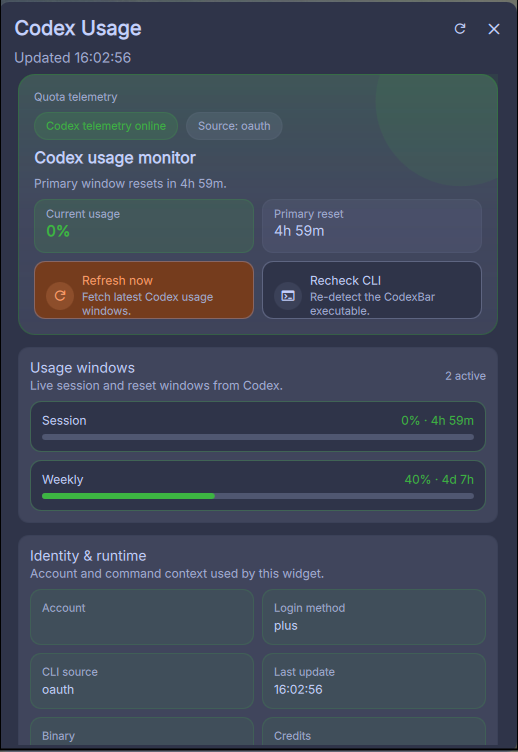

# dms-codexbar

A [DMS (Dank Material Shell)](https://github.com/DankMaterialShell/dms) plugin for monitoring **Codex** usage quotas. Wraps the [CodexBar CLI](https://github.com/steipete/CodexBar) to display Codex usage directly in your DankBar.

 

## Screenshot



## Features

- Bar pill showing Codex usage with color-coded percentage (green/yellow/red)
- Click-to-expand popout with Codex usage details
- Session, weekly, and tertiary usage bars with animated fills
- Reset countdown timers
- Credits display
- Configurable refresh interval, binary path, and source mode
- Auto-detects codexbar CLI from PATH, `~/.local/bin`, or `/usr/local/bin`

## Requirements

- [DMS (Dank Material Shell)](https://github.com/DankMaterialShell/dms) on Quickshell 0.2+
- [CodexBar CLI](https://github.com/steipete/CodexBar/releases) binary installed

## Installation

### 1. Install CodexBar CLI

Download the latest release for your platform:

```bash
# Using gh CLI
gh release download --repo steipete/CodexBar --pattern 'CodexBarCLI-*-linux-x86_64.tar.gz'
tar xzf CodexBarCLI-*-linux-x86_64.tar.gz
install -m 0755 CodexBarCLI ~/.local/bin/codexbar
```

Verify it works:

```bash
codexbar usage --format json --provider codex --source oauth
```

### 2. Install the plugin

**Option A: Install script**

```bash
git clone https://github.com/zakstam/dms-codexbar.git
cd dms-codexbar
./install.sh
```

**Option B: Manual**

```bash
mkdir -p ~/.config/DankMaterialShell/plugins/CodexBar
cp plugin.json CodexBarWidget.qml CodexBarSettings.qml \
   ~/.config/DankMaterialShell/plugins/CodexBar/
```

**Option C: Symlink (for development)**

```bash
ln -s "$(pwd)" ~/.config/DankMaterialShell/plugins/CodexBar
```

### 3. Enable in DMS

1. Restart Quickshell
2. Open DMS Settings > Plugins
3. Enable **CodexBar**
4. Add the widget to a DankBar section (left/center/right) in DMS Settings > DankBar

## Configuration

All settings are available in DMS Settings > Plugins > CodexBar:

| Setting          | Default         | Description                                          |
| ---------------- | --------------- | ---------------------------------------------------- |
| Refresh Interval | 2 minutes       | How often to poll the CLI (1m / 2m / 5m / 15m / 30m) |
| Binary Path      | *(auto-detect)* | Path to `codexbar` executable                        |
| Source Mode      | `oauth`         | Data source: `oauth` (recommended), `cli`, or `api`  |

### Source modes

- **oauth** (recommended): Uses your signed-in Codex auth/session.
- **cli**: Uses PTY probe to read Codex usage from CLI tooling directly.
- **api**: Fetches Codex usage via API token configuration in CodexBar.

## How it works

The plugin runs `codexbar usage --format json --provider codex --source <mode>` at the configured interval, parses the JSON output, and displays:

- **Bar pill**: `Codex` label + session percentage, color-coded by threshold
- **Popout**: Codex session/weekly/tertiary usage bars, reset countdowns, login method, credits, and account info

## License

MIT
